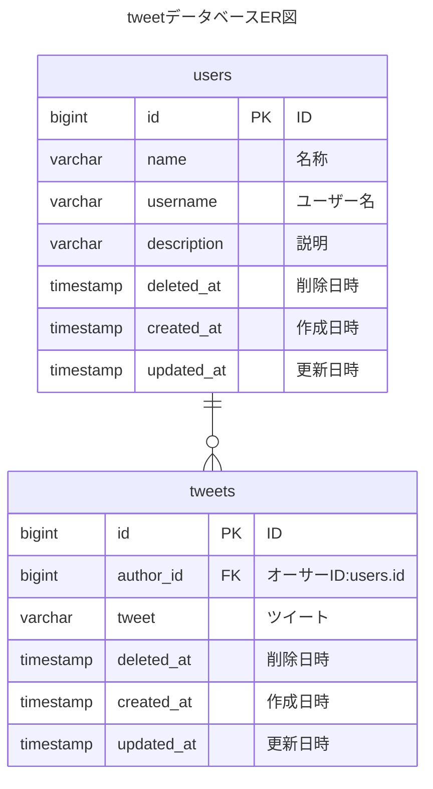

## 生Astroがmermaidに対応しているか確認する

生のAstoroが、Markdown拡張ツール「mermaid」に対応しているか確かめて見ましょう！  

😭 う〜ん。残念ながら、生のままではmermaidには対応していませんでした。

## 結論　\ うまく表示できました / 😁

📌 頭をひねりにひねって、下図のようにmermaid対応作戦は見事に成功した模様です。   
📌 しばらく経過を見てから、（秘密？）の荒業をブログに公表しますね。お楽しみに...

<pre class="mermaid">
---
title: "tweetデータベースER図(サンプル)"
---
erDiagram
    users ||--o{ tweets : ""

    users {
        bigint id PK "ID"
        varchar name "名称"
        varchar username "ユーザー名"
        varchar description "説明"
        timestamp deleted_at "削除日時"
        timestamp created_at "作成日時"
        timestamp updated_at "更新日時"
    }

    tweets {
        bigint id PK "ID"
        bigint author_id FK "オーサーID:users.id"
        varchar tweet "ツイート"
        timestamp deleted_at "削除日時"
        timestamp created_at "作成日時"
        timestamp updated_at "更新日時"
    }
</pre>